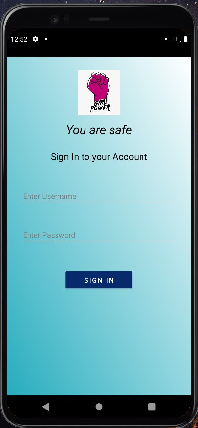

# YOU ARE SAFE
*An application which allows the user to share her location with a trusted family member/friend if she feels unsafe*
# Basic Features of the app:
- Sign up/Login
- Provide an emergency contact number at the time of signing up
- Share your location with the same number(provided at the time of signing up) when faced with an emergency
# Local Setup
- Clone the project
- Generate a new `Google Maps API key` and add it in the `values` folder
- Run the application
# App Screens : 

# Website :
- [Social Awareness website](https://hackviolet.ruchirasaha1.repl.co/)
